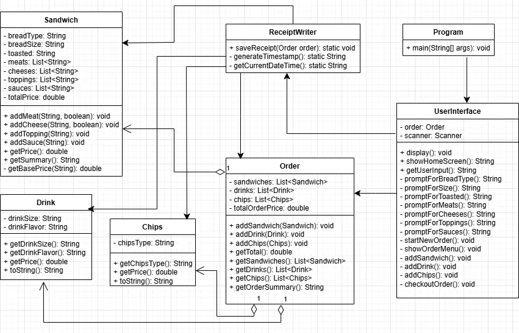

# The Nectar and Grain Ordering System

## Overview

**The Nectar and Grain** is a console-based ordering system designed to simulate the process of building, totaling, and saving a customer's sandwich, drink, and chip order. This application uses a custom menu with mythological-themed names for items and demonstrates fundamental Java object-oriented principles, including class modeling and file I/O for receipt generation.

---
## Class Diagram



## Key Features ✨

* **Order Creation:** Users can initiate a new order from the home screen.
* **Custom Sandwiches:** Users can select bread type, size (4", 8", 12"), toasting, meats, cheeses, toppings, and sauces. Pricing is dynamically calculated based on size and extra additions.
* **Drinks & Chips:** Users can add various sizes of drinks and types of chips to the order.
* **Dynamic Pricing:** The `Sandwich`, `Drink`, and `Chips` classes calculate their own prices, and the central `Order` class computes the final total.
* **Checkout & Receipt Generation:** The system displays an order summary and, upon confirmation, uses the `ReceiptWriter` utility to save a detailed receipt to a text file with a timestamped filename.

---

## Project Structure 📂

The application is organized into packages to ensure a clear separation of concerns:

| Package | Purpose | Key Classes |
| :--- | :--- | :--- |
| `com.pluralsight` | Application Entry Point | `Program` |
| `com.pluralsight.ui` | Handles all Console Input/Output | `UserInterface` |
| `com.pluralsight.model` | Core Business Logic/Domain Objects | `Order`, `Sandwich`, `Drink`, `Chips` |
| `com.pluralsight.util` | Utility for File Operations | `ReceiptWriter` |

---

## Installation and Setup ⚙️

This is a standard Java application and requires a Java Development Kit (JDK) to compile and run.

### Requirements
* **Java 17+ (or higher)**

### Running the Application

1.  **Clone the Repository:**
    ```bash
    git clone [https://github.com/JackFlack72/TheNectarAndGrain]
    cd the-nectar-and-grain
    ```
2.  **Compile and Run (using an IDE is recommended, but command line steps are below):**

    Assuming you are in the project's root directory, you can compile the files (you may need to adjust the classpath):
    ```bash
    # This command may vary based on your project structure and compiler
    javac src/main/java/com/pluralsight/*.java src/main/java/com/pluralsight/ui/*.java src/main/java/com/pluralsight/model/*.java src/main/java/com/pluralsight/util/*.java
    ```

    Then run the main class:
    ```bash
    java -cp src/main/java com.pluralsight.Program
    ```

3.  Follow the interactive prompts in the console to navigate the menu, build an order, and checkout.

---

## File Output

Receipts are generated upon checkout confirmation and saved into a dedicated directory:

`src/main/resources/receipts/`

Each receipt is named using a timestamp format (e.g., `20251113-110104.txt`).

---

## UML Class Diagram (Conceptual)
*(A visual representation of the class structure is recommended here for completeness.)*

The diagram illustrates the relationships, including the **Composition** relationship where the `Order` class aggregates `Sandwich`, `Drink`, and `Chips` objects.


---

## Future Enhancements (To-Do) 💡

* Implement **data persistence** for menu items (e.g., reading options and prices from configuration files like CSV or JSON).
* Add logic to **modify** or **remove** items from the current order before checkout.
* Improve **input validation** within the `UserInterface` to handle invalid or unexpected user input more gracefully.
* Add a **sales tax** calculation to the final total.